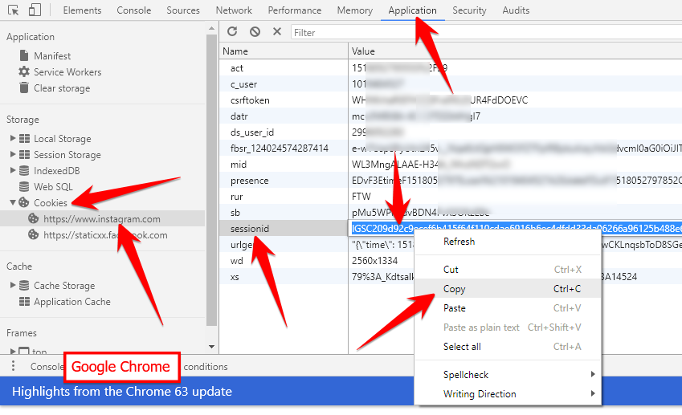
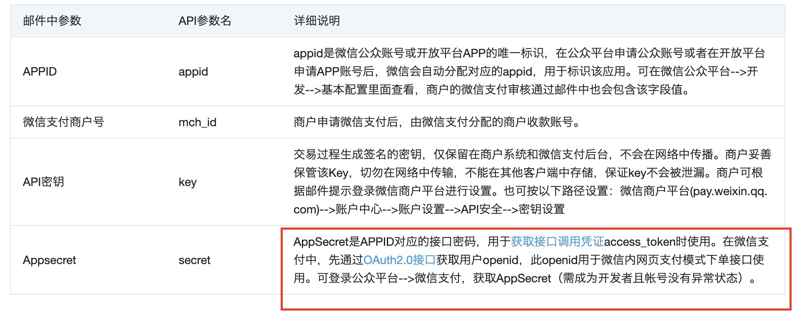

## 1. 认证 (Authentication) 和授权 (Authorization)的区别是什么？

这是一个绝大多数人都会混淆的问题。首先先从读音上来认识这两个名词，很多人都会把它俩的读音搞混，所以我建议你先先去查一查这两个单词到底该怎么读，他们的具体含义是什么。

说简单点就是：

**认证 (Authentication)：**  你是谁。


**授权 (Authorization)：** 你有权限干什么。


稍微正式点（啰嗦点）的说法就是：

- **Authentication（认证）** 是验证您的身份的凭据（例如用户名/用户ID和密码），通过这个凭据，系统得以知道你就是你，也就是说系统存在你这个用户。所以，Authentication 被称为身份/用户验证。
- **Authorization（授权）** 发生在 **Authentication（认证）** 之后。授权嘛，光看意思大家应该就明白，它主要掌管我们访问系统的权限。比如有些特定资源只能具有特定权限的人才能访问比如admin，有些对系统资源操作比如删除、添加、更新只能特定人才具有。

这两个一般在我们的系统中被结合在一起使用，目的就是为了保护我们系统的安全性。

## 2. 什么是Cookie ? Cookie的作用是什么?如何在服务端使用 Cookie ?



### 2.1 什么是Cookie ? Cookie的作用是什么?

Cookie 和 Session都是用来跟踪浏览器用户身份的会话方式，但是两者的应用场景不太一样。

维基百科是这样定义 Cookie 的：Cookies是某些网站为了辨别用户身份而储存在用户本地终端上的数据（通常经过加密）。简单来说： **Cookie 存放在客户端，一般用来保存用户信息**。

下面是 Cookie 的一些应用案例：

1. 我们在 Cookie 中保存已经登录过的用户信息，下次访问网站的时候页面可以自动帮你登录的一些基本信息给填了。除此之外，Cookie 还能保存用户首选项，主题和其他设置信息。
2. 使用Cookie 保存 session 或者 token ，向后端发送请求的时候带上 Cookie，这样后端就能取到session或者token了。这样就能记录用户当前的状态了，因为 HTTP 协议是无状态的。
3. Cookie 还可以用来记录和分析用户行为。举个简单的例子你在网上购物的时候，因为HTTP协议是没有状态的，如果服务器想要获取你在某个页面的停留状态或者看了哪些商品，一种常用的实现方式就是将这些信息存放在Cookie 

### 2.2 如何在服务端使用 Cookie 呢？

这部分内容参考：https://attacomsian.com/blog/cookies-spring-boot, 更多如何在Spring Boot中使用Cookie 的内容可以查看这篇文章。

**1)设置cookie返回给客户端**

```java
@GetMapping("/change-username")
public String setCookie(HttpServletResponse response) {
    // 创建一个 cookie
    Cookie cookie = new Cookie("username", "Jovan");
    //设置 cookie过期时间
    cookie.setMaxAge(7 * 24 * 60 * 60); // expires in 7 days
    //添加到 response 中
    response.addCookie(cookie);

    return "Username is changed!";
}
```

**2) 使用Spring框架提供的`@CookieValue`注解获取特定的 cookie的值**

```java
@GetMapping("/")
public String readCookie(@CookieValue(value = "username", defaultValue = "Atta") String username) {
    return "Hey! My username is " + username;
}
```

**3) 读取所有的 Cookie 值**

```java
@GetMapping("/all-cookies")
public String readAllCookies(HttpServletRequest request) {

    Cookie[] cookies = request.getCookies();
    if (cookies != null) {
        return Arrays.stream(cookies)
                .map(c -> c.getName() + "=" + c.getValue()).collect(Collectors.joining(", "));
    }

    return "No cookies";
}
```

## 3. Cookie 和 Session 有什么区别？如何使用Session进行身份验证？

**Session 的主要作用就是通过服务端记录用户的状态。** 典型的场景是购物车，当你要添加商品到购物车的时候，系统不知道是哪个用户操作的，因为 HTTP 协议是无状态的。服务端给特定的用户创建特定的 Session 之后就可以标识这个用户并且跟踪这个用户了。

**Cookie 数据保存在客户端(浏览器端)，Session 数据保存在服务器端。相对来说 Session 安全性更高。如果使用 Cookie 的一些敏感信息不要写入 Cookie 中，最好能将 Cookie 信息加密然后使用到的时候再去服务器端解密。**

**那么，如何使用Session进行身份验证？**

很多时候我们都是通过 SessionID 来实现特定的用户，SessionID 一般会选择存放在 Redis 中。举个例子：用户成功登陆系统，然后返回给客户端具有 SessionID 的 Cookie，当用户向后端发起请求的时候会把 SessionID 带上，这样后端就知道你的身份状态了。关于这种认证方式更详细的过程如下：


1. 用户向服务器发送用户名和密码用于登陆系统。
2. 服务器验证通过后，服务器为用户创建一个 Session，并将 Session信息存储 起来。
3. 服务器向用户返回一个 SessionID，写入用户的 Cookie。
4. 当用户保持登录状态时，Cookie 将与每个后续请求一起被发送出去。
5. 服务器可以将存储在 Cookie 上的 Session ID 与存储在内存中或者数据库中的 Session 信息进行比较，以验证用户的身份，返回给用户客户端响应信息的时候会附带用户当前的状态。

使用 Session 的时候需要注意下面几个点：

1. 依赖Session的关键业务一定要确保客户端开启了Cookie。
2. 注意Session的过期时间

花了个图简单总结了一下Session认证涉及的一些东西。


另外，Spring Session提供了一种跨多个应用程序或实例管理用户会话信息的机制。如果想详细了解可以查看下面几篇很不错的文章：

- [Getting Started with Spring Session](https://codeboje.de/spring-session-tutorial/)
- [Guide to Spring Session](https://www.baeldung.com/spring-session)
- [Sticky Sessions with Spring Session & Redis](https://medium.com/@gvnix/sticky-sessions-with-spring-session-redis-bdc6f7438cc3)

## 4.如果没有Cookie的话Session还能用吗？

这是一道经典的面试题！

一般是通过 Cookie 来保存 SessionID ，假如你使用了 Cookie 保存 SessionID的方案的话， 如果客户端禁用了Cookie，那么Session就无法正常工作。

但是，并不是没有 Cookie 之后就不能用 Session 了，比如你可以将SessionID放在请求的 url 里面`https://javaguide.cn/?session_id=xxx` 。这种方案的话可行，但是安全性和用户体验感降低。当然，为了你也可以对  SessionID 进行一次加密之后再传入后端。

## 5.为什么Cookie 无法防止CSRF攻击，而token可以？

**CSRF（Cross Site Request Forgery）**一般被翻译为 **跨站请求伪造** 。那么什么是 **跨站请求伪造** 呢？说简单用你的身份去发送一些对你不友好的请求。举个简单的例子：

小壮登录了某网上银行，他来到了网上银行的帖子区，看到一个帖子下面有一个链接写着“科学理财，年盈利率过万”，小壮好奇的点开了这个链接，结果发现自己的账户少了10000元。这是这么回事呢？原来黑客在链接中藏了一个请求，这个请求直接利用小壮的身份给银行发送了一个转账请求,也就是通过你的 Cookie 向银行发出请求。

```
<a src=http://www.mybank.com/Transfer?bankId=11&money=10000>科学理财，年盈利率过万</>
```

上面也提到过，进行Session 认证的时候，我们一般使用 Cookie 来存储 SessionId,当我们登陆后后端生成一个SessionId放在Cookie中返回给客户端，服务端通过Redis或者其他存储工具记录保存着这个Sessionid，客户端登录以后每次请求都会带上这个SessionId，服务端通过这个SessionId来标示你这个人。如果别人通过 cookie拿到了 SessionId 后就可以代替你的身份访问系统了。

 Session 认证中 Cookie 中的 SessionId是由浏览器发送到服务端的，借助这个特性，攻击者就可以通过让用户误点攻击链接，达到攻击效果。

但是，我们使用 token 的话就不会存在这个问题，在我们登录成功获得 token 之后，一般会选择存放在 local storage 中。然后我们在前端通过某些方式会给每个发到后端的请求加上这个 token,这样就不会出现 CSRF 漏洞的问题。因为，即使有个你点击了非法链接发送了请求到服务端，这个非法请求是不会携带 token 的，所以这个请求将是非法的。

需要注意的是不论是 Cookie 还是 token 都无法避免跨站脚本攻击（Cross Site Scripting）XSS。

> 跨站脚本攻击（Cross Site Scripting）缩写为 CSS 但这会与层叠样式表（Cascading Style Sheets，CSS）的缩写混淆。因此，有人将跨站脚本攻击缩写为XSS。

XSS中攻击者会用各种方式将恶意代码注入到其他用户的页面中。就可以通过脚本盗用信息比如cookie。

推荐阅读：[如何防止CSRF攻击？—美团技术团队](https://tech.meituan.com/2018/10/11/fe-security-csrf.html)

## 6. 什么是 Token?什么是 JWT?如何基于Token进行身份验证？

我们在上一个问题中探讨了使用 Session 来鉴别用户的身份，并且给出了几个 Spring Session 的案例分享。 我们知道 Session  信息需要保存一份在服务器端。这种方式会带来一些麻烦，比如需要我们保证保存  Session  信息服务器的可用性、不适合移动端（依赖Cookie）等等。

有没有一种不需要自己存放 Session  信息就能实现身份验证的方式呢？使用 Token 即可！JWT （JSON Web Token） 就是这种方式的实现，通过这种方式服务器端就不需要保存 Session 数据了，只用在客户端保存服务端返回给客户的 Token 就可以了，扩展性得到提升。

**JWT 本质上就一段签名的 JSON 格式的数据。由于它是带有签名的，因此接收者便可以验证它的真实性。**

下面是 [RFC 7519](https://tools.ietf.org/html/rfc7519) 对 JWT 做的较为正式的定义。

> JSON Web Token (JWT) is a compact, URL-safe means of representing claims to be transferred between two parties. The claims in a JWT are encoded as a JSON object that is used as the payload of a JSON Web Signature (JWS) structure or as the plaintext of a JSON Web Encryption (JWE) structure, enabling the claims to be digitally signed or integrity protected with a Message Authentication Code (MAC) and/or encrypted.    ——[JSON Web Token (JWT)](https://tools.ietf.org/html/rfc7519)

JWT 由 3 部分构成:

1. Header :描述 JWT 的元数据。定义了生成签名的算法以及 Token 的类型。
2. Payload（负载）:用来存放实际需要传递的数据
3. Signature（签名）：服务器通过`Payload`、`Header`和一个密钥(`secret`)使用 Header 里面指定的签名算法（默认是 HMAC SHA256）生成。

在基于 Token 进行身份验证的的应用程序中，服务器通过`Payload`、`Header`和一个密钥(`secret`)创建令牌（`Token`）并将 `Token` 发送给客户端，客户端将 `Token` 保存在 Cookie 或者 localStorage 里面，以后客户端发出的所有请求都会携带这个令牌。你可以把它放在 Cookie 里面自动发送，但是这样不能跨域，所以更好的做法是放在 HTTP  Header 的 Authorization字段中：` Authorization: Bearer Token`。


1. 用户向服务器发送用户名和密码用于登陆系统。
2. 身份验证服务响应并返回了签名的 JWT，上面包含了用户是谁的内容。
3. 用户以后每次向后端发请求都在Header中带上 JWT。
4. 服务端检查 JWT 并从中获取用户相关信息。


推荐阅读：

- [JWT (JSON Web Tokens) Are Better Than Session Cookies](https://dzone.com/articles/jwtjson-web-tokens-are-better-than-session-cookies)
- [JSON Web Tokens (JWT) 与 Sessions](https://juejin.im/entry/577b7b56a3413100618c2938)
- [JSON Web Token 入门教程](https://www.ruanyifeng.com/blog/2018/07/json_web_token-tutorial.html)
- [彻底理解Cookie，Session，Token](https://mp.weixin.qq.com/s?__biz=Mzg2OTA0Njk0OA==&mid=2247485603&idx=1&sn=c8d324f44d6102e7b44554733da10bb7&chksm=cea24768f9d5ce7efe7291ddabce02b68db34073c7e7d9a7dc9a7f01c5a80cebe33ac75248df&token=844918801&lang=zh_CN#rd)

## 7 什么是OAuth 2.0？

OAuth 是一个行业的标准授权协议，主要用来授权第三方应用获取有限的权限。而 OAuth 2.0是对 OAuth 1.0 的完全重新设计，OAuth 2.0更快，更容易实现，OAuth 1.0 已经被废弃。详情请见：[rfc6749](https://tools.ietf.org/html/rfc6749)。

实际上它就是一种授权机制，它的最终目的是为第三方应用颁发一个有时效性的令牌 token，使得第三方应用能够通过该令牌获取相关的资源。

OAuth 2.0 比较常用的场景就是第三方登录，当你的网站接入了第三方登录的时候一般就是使用的 OAuth 2.0 协议。

另外，现在OAuth 2.0也常见于支付场景（微信支付、支付宝支付）和开发平台（微信开放平台、阿里开放平台等等）。

微信支付账户相关参数：



**推荐阅读：**

- [OAuth 2.0 的一个简单解释](http://www.ruanyifeng.com/blog/2019/04/oauth_design.html)
- [10 分钟理解什么是 OAuth 2.0 协议](https://deepzz.com/post/what-is-oauth2-protocol.html)
- [OAuth 2.0 的四种方式](http://www.ruanyifeng.com/blog/2019/04/oauth-grant-types.html)
- [GitHub OAuth 第三方登录示例教程](http://www.ruanyifeng.com/blog/2019/04/github-oauth.html)

## 8 什么是 SSO?

SSO(Single Sign On)即单点登录说的是用户登陆多个子系统的其中一个就有权访问与其相关的其他系统。举个例子我们在登陆了京东金融之后，我们同时也成功登陆京东的京东超市、京东家电等子系统。

## 9.SSO与OAuth2.0的区别

OAuth 是一个行业的标准授权协议，主要用来授权第三方应用获取有限的权限。SSO解决的是一个公司的多个相关的自系统的之间的登陆问题比如京东旗下相关子系统京东金融、京东超市、京东家电等等。

## 参考

- https://medium.com/@sherryhsu/session-vs-token-based-authentication-11a6c5ac45e4
- https://www.varonis.com/blog/what-is-oauth/
- https://tools.ietf.org/html/rfc6749
